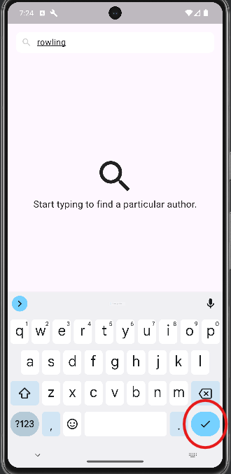

# Ball Squad 

Welcome to the **Ball Squad** project. It is a mobile application that finds authors with a given name and returns basic information about them and the books they have written.
**The program has only been tested on an Android device, so please test it only on this platform.**
The program should also work on the iOS system, but this has not been tested.

## Table of Contents
- [API](#API)
- [Features](#features)
- [Installation](#installation)
- [Packages](#packages)
- [Possible improvements](#possible-improvements)

## API
This application uses open API that you can find under this [link](https://openlibrary.org/dev/docs/api/authors)

## Features

### Finding authors

When you launch the program, a starting page with search bar will be displayed. Simply write down author's name and press the "submit" button on your keyboard
like in example below to look for an author:



### Displaying basic information about author

After entering the author's name, a list of all matching authors found in the API will be displayed. This list contains basic information about each author.


### Displaying all author's books

If you click on one of the listed blocks, you will be taken to a new view that shows all the books written by that author.


### Error management

Different widgets are displayed depending on the situation. For example, if there is no response from the API or the application cannot find an author with the 
given name, the application will display an appropriate message on the screen.

## Installation

You can download apk file from apk folder that is inside this project. Simply download the apk from github, install it on you mobile device *with android system*
and launch it.

### Alternatively yo can do the following steps:
1. You have to install IDE. This project was created using Android Studio IDE and I highly recommend it. Go to the website [here](https://developer.android.com/studio) and follow their steps to install it.
2. After you install your IDE of choice you have to install Flutter framework.  Yo can do that by adding Flutter plugin in Android Studio. Alternatively you can go to the website [here](https://docs.flutter.dev/get-started/install) and follow their steps to install it.
3. Install git bash or github desktop. You can do this by going to this [website](https://git-scm.com/downloads) to download git bash or to this[website](https://desktop.github.com/download/) to download github desktop.
4. Clone the repository using the code below:
    ```sh
    git clone https://github.com/Borokoro/people_management.git
    ```
   or clone this repository from your github desktop.
5. Open the project
6. Use the commands in your project file:
    ```
    flutter upgrade
    flutter pub get
    ```
7. Install emulator or connect your phone to your computer using USB cable with  USB Debugging turned on
8. Run application. I highly recommend to run application in release mode, for the best effect, using the command below:
    ```
    flutter run --release
    ```

## Packages

- [flutter_bloc](https://pub.dev/packages/flutter_bloc)
- [get_it](https://pub.dev/packages/get_it)
- [bloc](https://pub.dev/packages/bloc)
- [path_provider](https://pub.dev/packages/path_provider)
- [equatable](https://pub.dev/packages/equatable)
- [dartz](https://pub.dev/packages/dartz)
- [dio](https://pub.dev/packages/dio)
- [requests_inspector](https://pub.dev/packages/requests_inspector)

## Possible improvements

- Making more advanced UI.
- Displaying more information about author.
- Adding pagination.

 
